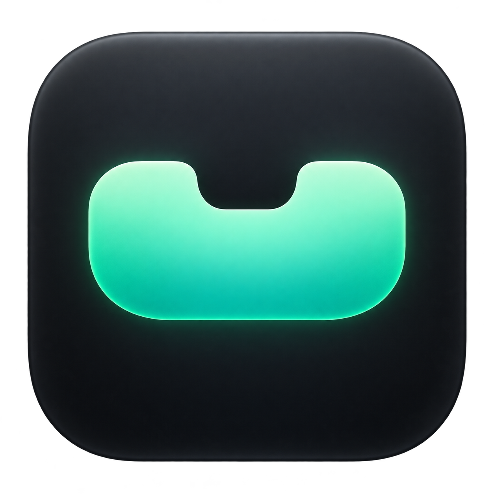

  
  <h1>NotchFlow</h1>
  
Turn your MacBook notch into a calm, compact productivity space.

  
Keep music, events, files, notes, and focus timers naturally within reach.

  
<strong>macOS 14 or later · Apple silicon and Intel Macs</strong>

  

    <a href="https://github.com/jb-han-cording/NotchFlow/raw/refs/heads/main/dist/NotchFlow-0.3.4.dmg"><strong>Download NotchFlow 0.3.4</strong></a>
  

  
<a href="README.en.md">English</a> · <a href="README.md">한국어</a>

## A little workspace in your notch

NotchFlow stays quiet at the size of your notch, then opens smoothly when you hover or click. It keeps the things you check most often close without taking over your screen.

- **Music** — Connect Apple Music or Spotify to see the current track and control previous, play/pause, and next. Choose whether a track change should expand the music view automatically.
- **Calendar** — See today’s events and the next event, with an in-app reminder before it starts.
- **File Shelf** — Keep files and folders nearby and drag them back out when you need them. Your original files are never moved or deleted.
- **Quick Notes** — Capture an idea immediately, with checklist support and automatic local saving.
- **Focus Timer** — Start a timer from the notch or menu bar and keep the remaining time in view.
- **Menu bar controls** — Open modules and the timer without expanding the notch, and hide the menu bar icon when you prefer.

NotchFlow also works on Macs without a physical notch and on external displays, where it appears as a small floating island near the top center.

## Install

### New in 0.3.4

- **App-specific auto-hide** — Add apps in Settings → General to hide the panel while those apps are active. It returns when you switch to another app.
- **Battery and power alerts** — Receive notices for power connection and disconnection, battery levels at 20% and 10% or below, and a full charge. Manage these in Settings → Notifications.
- **Join your next meeting** — Calendar finds Zoom, Google Meet, and Teams links in event URLs, locations, or notes and shows a join button for the next meeting.
- **Automatic shelf cleanup** — Choose one hour, one day, or one week in Settings → Modules. Disabled by default. Expiry is measured from when an item was added; only shelf references are removed, never original files.
- **Idle glass effect** — On displays without a notch, the collapsed panel now shows the glass effect when Liquid Glass is enabled.

### Download and launch

1. [Download the NotchFlow DMG](https://github.com/jb-han-cording/NotchFlow/raw/refs/heads/main/dist/NotchFlow-0.3.4.dmg).
2. Open the DMG and drag **NotchFlow** to **Applications**.
3. Launch NotchFlow from Applications.
4. If macOS says it cannot verify the developer, Control-click the app, choose **Open**, and confirm.

NotchFlow is a menu bar app, so it does not open a regular window or stay in the Dock. Look for the notch panel or the menu bar icon after launching it.

## Get started

1. Click the notch to open NotchFlow.
2. Open **Settings → Connections** and connect your music player and calendar.
3. Allow the macOS permissions requested for the features you want to use.
4. Open **Settings → Modules** to choose what appears in the notch.

The default global shortcut is **Option + Space**. You can change or disable it in Settings.

## If permissions do not work

### Music is not showing

- Open Apple Music or the Spotify desktop app and start playback first.
- In **Settings → Connections → Music**, choose the player and try connecting again.
- If access was denied, allow NotchFlow under **System Settings → Privacy & Security → Automation**.

Browser playback, YouTube, and other players are not currently supported.

### Calendar access is not appearing

- Use **Settings → Connections → Calendar** to request access again.
- If access was previously denied, allow NotchFlow under **System Settings → Privacy & Security → Calendars**.
- Relaunch NotchFlow after changing the permission.

## Make it yours

Settings lets you adjust the modules, hover and click behavior, notch width and corner radius, transparency, blur, theme, animation speed, reduced motion behavior, track-change expansion, reminders, launch at login, menu bar visibility, and update checks.

## Updates

Use **Settings → Updates** to check for a newer version and download it. Replacing the app keeps your existing settings, notes, and file shelf data.

The updater checks the project’s HTTPS manifest on GitHub, verifies the downloaded DMG checksum, and opens it for you to replace the app in Applications.

## Privacy and local data

NotchFlow does not send your notes, calendar events, or file list anywhere. It includes no analytics or user tracking. Data stays on this Mac at:

`~/Library/Application Support/NotchFlow/`

- Music information is read only from the player you connect.
- Calendar access is used to show today’s events.
- The file shelf stores references only for files you add yourself.
- GitHub is contacted only when update checks are enabled or requested.

## Good to know

- Requires **macOS 14.0 or later**.
- Supports the **Apple Music** and **Spotify desktop apps**.
- Spotify artwork may be shown as a default music icon.
- Calendar reminders are delivered while NotchFlow is running.
- Notch placement can vary with MacBook models, external displays, full-screen apps, and menu bar auto-hide. You can choose the display and adjust the notch width in Settings.

For help or feature requests, visit [GitHub Issues](https://github.com/jb-han-cording/NotchFlow/issues).

---

Current version: **0.3.4 (build 11)**
